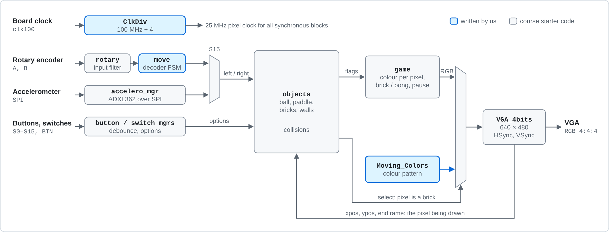
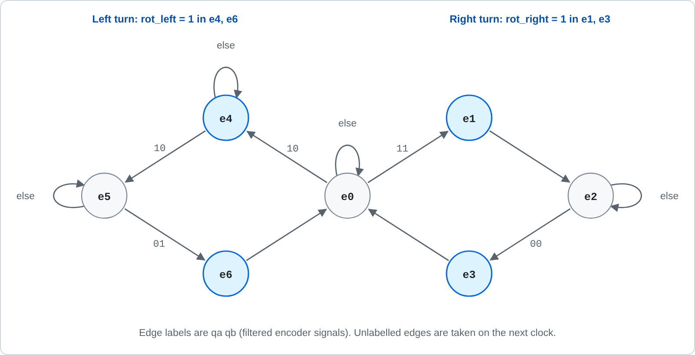
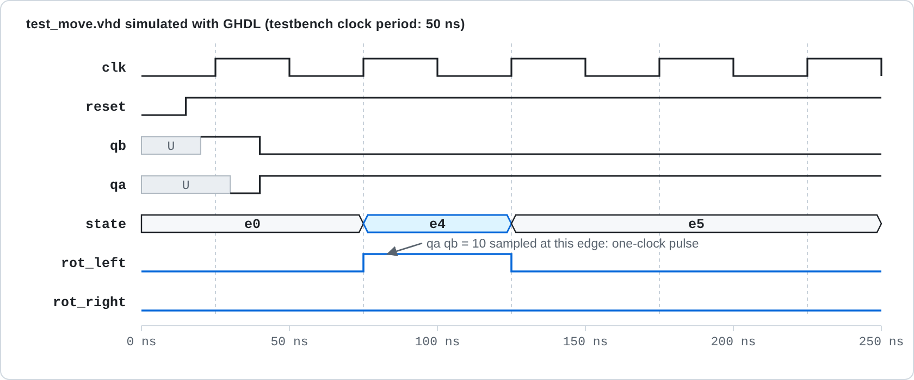
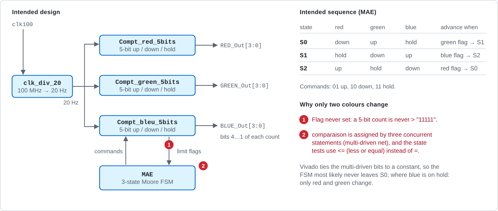
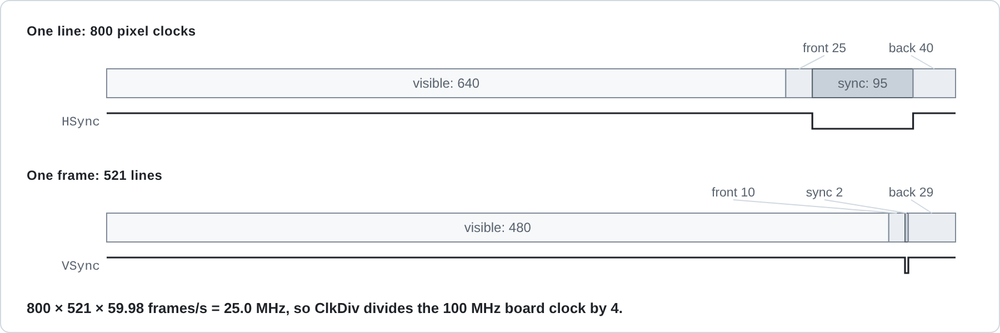

# Brick Breaker on FPGA

Course mini-project, 3rd-year Electronics (L3 EEA, CMI track), Sorbonne Université, autumn 2021.
Edouard David and Alexandre Naprix.

The course provided a working game framework in VHDL (VGA controller, ball, paddle and brick logic, game controller, I/O managers). The project was to complete three tasks inside it. This README separates what we wrote from what was provided.



*Signal path on the Basys 3. Blue blocks are ours; grey blocks are course starter code. The VGA controller scans the screen and feeds the current pixel position back, so every other block works out, pixel by pixel, what should be drawn.*

## Target

| | |
|---|---|
| Board | Digilent Basys 3 (Xilinx Artix-7, XC7A35T-1CPG236C) |
| Language | VHDL |
| Tools | Vivado 2018.3, EDA Playground |
| Display | VGA 640 × 480 at 60 Hz, 25 MHz pixel clock, 4 bits per colour |
| Input | Rotary encoder (paddle), push buttons, switches |

## Our work

| Task | Files (`project_1_TP_ELEC.srcs/`) | Function | Status |
|---|---|---|---|
| Pixel clock | `sources_1/new/Clk25MHz.vhd` (entity `ClkDiv`) | Divides the 100 MHz board clock to 25 MHz | Working |
| 1. Moving colours | `sources_1/new/Moving_Colors.vhd`, `CLK_DIV_20.vhd`, `Compt_red_5bits.vhd`, `Compt_green_5bits.vhd`, `Compt_bleu_5bits.vhd`, `MAE.vhd`; task top level `sources_1/imports/TACHE_1/Top.vhd` | Colour pattern for the VGA output: a 20 Hz clock drives three 5-bit up/down colour counters, sequenced by a three-state Moore FSM. In the game it colours the bricks | Partial: only two of the three colours cycle (see Known issues) |
| 2. Rotary encoder | `sources_1/new/move.vhd`, testbench `sim_1/new/test_move.vhd` | Seven-state FSM that decodes the encoder's quadrature signals into one-cycle `rot_left` / `rot_right` pulses that move the paddle | Working |
| 3. Game-mode FSM | not included | Pause with debounce counters; running, won and lost states | Not completed: our FSM raised the win flag at start-up |

### Rotary encoder



*`move.vhd`. From `e0`, the filtered inputs `qa qb` choose the right-turn loop (`e1`–`e3`) or the left-turn loop (`e4`–`e6`). The outputs are Moore outputs: each pulse lasts one clock.*

The encoder has two contacts, A and B, which close in turn as the knob is turned; the order tells you the direction. The provided `rotary.vhd` samples and filters them into two signals:

| Signal | Meaning |
|---|---|
| `qa` | 1 while both contacts are closed, 0 once both are open again |
| `qb` | which contact was last closed on its own: 1 for B, 0 for A |

`move.vhd` then reads direction from the pair. Both contacts closed after B was alone means a turn to the right (`e1`); after A was alone, a turn to the left (`e4`). The FSM waits in `e2` or `e5` until the contacts open again, then emits a second pulse in the same direction (`e3`, `e6`). So one detent of the knob produces two one-clock pulses: one as it closes, one as it releases.



*The committed testbench, simulated with GHDL. `qa qb = 10` is sampled at the 75 ns edge, the FSM enters `e4` and `rot_left` is high for one clock. The state row is derived from `move.vhd`, since the simulator does not record enumerated types in VCD files.*

### Moving colours



*Intended design and the two defects that stop it from working (details under Known issues).*

### Display timing



*Timing of the course's VGA controller. One line is 800 pixel clocks and one frame is 521 lines, which at 60 frames per second sets the 25 MHz pixel clock produced by `ClkDiv`.*

## Provided by the course

Everything under `project_1_TP_ELEC.srcs/sources_1/imports/Sources_Debut_TP_2021/` is course starter code; the file headers name the author. It includes the VGA controller, the ball, paddle, brick and bounce logic, the game controller, the button, switch and seven-segment managers, the encoder input filter, the top levels for the Basys 3 and Nexys boards, and Digilent's ADXL362 accelerometer controller.

## Building

The Vivado project file (`project_1_TP_ELEC.xpr`) still refers to some files by their paths on the original machine. The reliable way to rebuild is a fresh project:

1. In Vivado, create an RTL project for part `xc7a35tcpg236-1`.
2. Add the VHDL files from `sources_1/new/` and `sources_1/imports/Sources_Debut_TP_2021/VHDL/`.
3. For the game, set `top_baxys` (in `Top_Basys.vhd`) as the top module and add `constrs_1/imports/XDC/Console_Basys.xdc`.
   For task 1 alone, use `sources_1/imports/TACHE_1/Top.vhd` with `constrs_1/imports/TACHE_1/Tache1_Basys.xdc`.
4. Run synthesis and implementation, generate the bitstream and program the board over USB.

`MAE.vhd` has to be corrected before the design will elaborate (see below).

## Verification

`test_move.vhd` applies one quadrature transition to `move` and is checked by reading the waveform (`test_move_behav.wcfg`, or the figure above). It has no self-checking assertions.

## Known issues

- **Only two of three colours cycle (task 1).** Two defects, marked 1 and 2 in the moving-colours figure:
  1. The counters' limit flag is set by `temp > "11111"`, which a 5-bit value can never satisfy, so the flags are never raised.
  2. In `MAE.vhd`, the signal `comparaison` is assigned by three separate concurrent statements, so it has three drivers. Vivado reports a multi-driven net (Synth 8-6859) and keeps a constant driver. The state-transition tests also use `<=` (less than or equal) where `=` was intended.

  The FSM most likely never leaves `S0`, where the blue counter is on hold, so only red and green change.
- **`MAE.vhd` does not compile as committed.** Its outputs are declared 3 bits wide but are assigned 2-bit constants and connected to 2-bit signals in `Moving_Colors.vhd`.
- **Colour mapping.** Both top levels connect `BLUE_OUT` to the red channel and `RED_OUT` to the blue channel.
- **Task 3** was not completed and is not in this repository.

## Repository layout

```
project_1_TP_ELEC.srcs/
  sources_1/new/                                our modules
  sources_1/imports/Sources_Debut_TP_2021/VHDL/ course starter code
  sources_1/imports/TACHE_1/Top.vhd             task 1 top level
  sim_1/new/test_move.vhd                       encoder testbench
  constrs_1/imports/                            pin constraints (Basys 3, Nexys)
project_1_TP_ELEC.xpr                           Vivado 2018.3 project
test_move_behav.wcfg                            waveform configuration
docs/                                           figures used in this README
```
